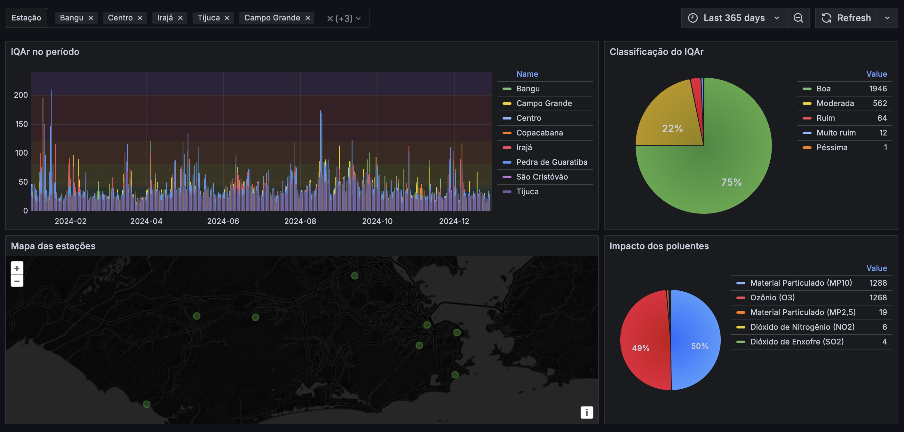

# qualidade-ar-smac

[](https://opensource.org/licenses/MIT) [](https://sonarcloud.io/summary/new_code?id=esign-consulting_qualidade-ar-smac) [](https://hub.docker.com/r/esignbr/qualidade-ar-smac) [](https://qualidadearsmac.azurewebsites.net/api/boletim)

Dados de qualidade do ar coletados da [Prefeitura do RJ - Secretaria Municipal de Meio Ambiente (SMAC)](https://ambienteclima.prefeitura.rio). Os dados são publicados pela SMAC nos seguintes meios:

- [Boletim Diário](http://jeap.rio.rj.gov.br/je-metinfosmac/boletim)
- [Portal de dados abertos da Prefeitura do RJ - Data.Rio](https://www.data.rio/maps/5b1bf5c3e5114564bbf9b7a372b85e17/about)
- [Portal MonitorAr do Ministério de Meio Ambiente e Mudança do Clima](https://monitorar.mma.gov.br)

## Execução

A API é uma aplicação [Spring Boot](https://spring.io/projects/spring-boot) e para ser inicializada execute (requer [Maven](https://maven.apache.org)):

`mvn spring-boot:run`

A API também pode ser inicializada como [contâiner](https://en.wikipedia.org/wiki/Container_Linux). Para inicializar a API deste modo, execute (requer [Docker](https://www.docker.com)):

`docker run --name smac --rm -d -p 8080:8080 esignbr/qualidade-ar-smac`

## Gráfico dos últimos 365 dias

Os dados de qualidade do ar dos últimos 365 dias, carregados para uma base de dados [TimescaleDB](https://www.timescale.com/go/time-series), podem ser visualizados num dashboard do [Grafana](https://grafana.com). Para isso, siga os seguintes passos (requer [docker-compose](https://docs.docker.com/compose)):

1. Inicialize o ambiente: `docker-compose up -d`;
2. Pelo browser entre em <http://localhost:3000>;
3. Entre no dashboard `SMAC`.



:white_check_mark: O Grafana também pode ser visualizado [aqui](https://grafana.ashycliff-8ff39973.brazilsouth.azurecontainerapps.io).

### Consultas aos dados

Se preferir, obtenha diretamente todos os dados da SMAC, através da **Query Tool** do [pgAdmin](http://localhost:8085) (usuário `esign@esign.com.br` e senha `S3cr3t`):

```sql
SELECT md.*
FROM medicoes_diarias AS md
JOIN estacoes AS e ON e.codigo = md.codigo_estacao
WHERE e.orgao = 'SMAC'
ORDER BY md.data
```

Último índice de qualidade do ar das estações de monitoramento da SMAC:

```sql
SELECT e.nome AS "estacao",
  (SELECT md1.iqar
     FROM medicoes_diarias AS md1
    WHERE md1.codigo_estacao = e.codigo
      AND md1.data = (SELECT MAX(md2.data)
                         FROM medicoes_diarias AS md2
                        WHERE md2.codigo_estacao = e.codigo)
  ) AS "iqar"
FROM estacoes AS e
WHERE e.orgao = 'SMAC'
```

Poluentes que mais impactaram o índice de qualidade do ar no período:

```sql
SELECT md.poluente, COUNT(*) AS "qtde"
FROM medicoes_diarias AS md
JOIN estacoes AS e ON e.codigo = md.codigo_estacao
WHERE e.orgao = 'SMAC'
GROUP BY md.poluente
ORDER BY qtde DESC
```

Distribuição da classificação da qualidade do ar no período:

```sql
SELECT md.classificacao, COUNT(*) AS "qtde"
FROM medicoes_diarias AS md
JOIN estacoes AS e ON e.codigo = md.codigo_estacao
WHERE e.orgao = 'SMAC'
GROUP BY md.classificacao
ORDER BY qtde DESC
```

:white_check_mark: O pgAdmin pode ser usado [aqui](https://pgadmin.ashycliff-8ff39973.brazilsouth.azurecontainerapps.io).

### Dump da base de dados

`pg_dump -h localhost -p 5432 -U postgres -f dump.sql postgres`

## Dados históricos

Dados históricos horários no formato CSV podem ser obtidos do Data.Rio através do comando:

`curl 'https://hub.arcgis.com/api/v3/datasets/5b1bf5c3e5114564bbf9b7a372b85e17_2/downloads/data?format=csv&spatialRefId=31983'`
